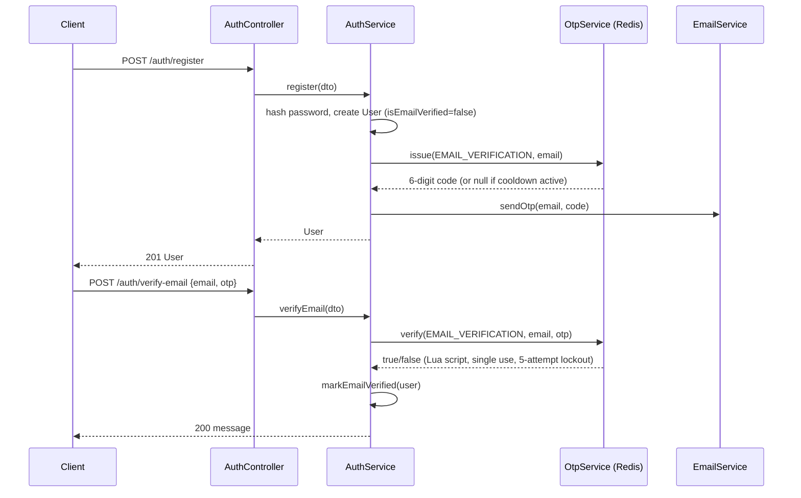
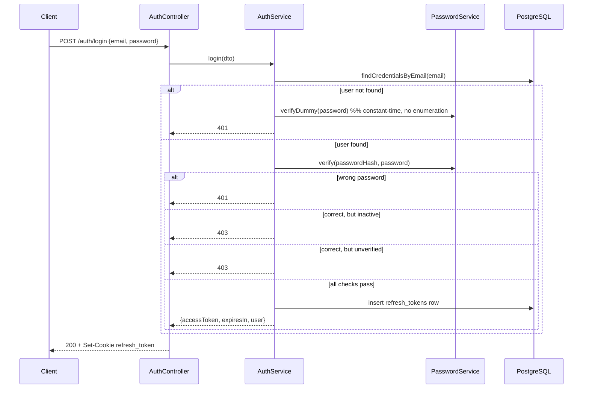
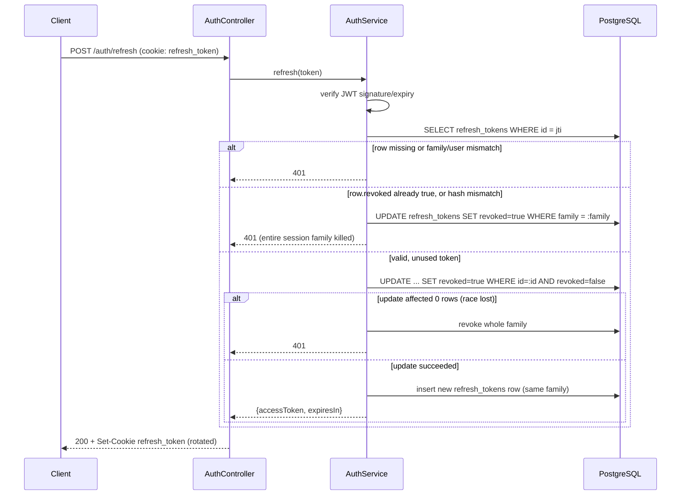
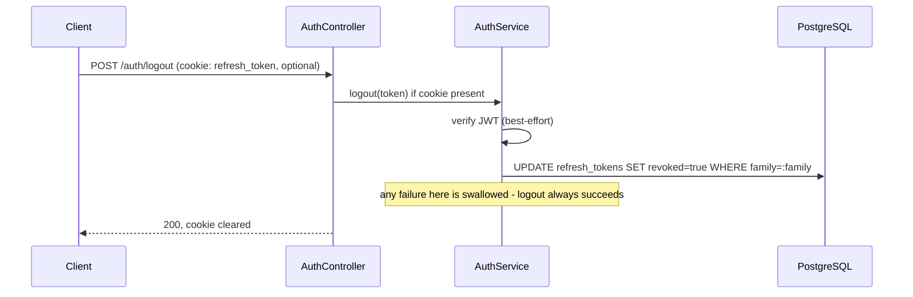

# Authentication

All authentication logic lives in `src/auth/` (`AuthController`, `AuthService`, `PasswordService`, `OtpService`) plus the `RefreshToken` entity and, optionally, `GoogleStrategy`.

## Registration

`POST /auth/register` (`AuthService.register`) accepts `TENANT` or `OWNER` only — `ADMIN` and `MAINTENANCE_STAFF` cannot self-register. On success:

1. Rejects if the email already exists (`409`).
2. Hashes the password (see below) and creates the `User` row with `isEmailVerified: false`.
3. Issues an email-verification OTP and sends it (best-effort; a mail failure does not fail the request).

## Password hashing

`PasswordService.hash` / `PasswordService.verify`:

- The raw password is first hashed with SHA-256 (`node:crypto`), producing a fixed-length input. This is done because `bcrypt` silently ignores any bytes past the first 72, and multi-byte (e.g. non-Latin) characters would otherwise let an attacker's password collide with a truncated version of the real one.
- The SHA-256 digest is then hashed with `bcrypt` at cost factor 12.
- `verifyDummy(password)` hashes a random value once and reuses it to run a real `bcrypt.compare` even when the email does not exist, so that the response time for "wrong password" and "unknown email" is not distinguishable (`AuthService.login`).

## Access tokens

- Signed with `JWT_ACCESS_SECRET`, algorithm `HS256`.
- Payload: `{ sub: userId }` only.
- Lifetime: `JWT_ACCESS_EXPIRES_IN` (default `15m`).
- Verified on every request by `JwtAuthGuard`, which also re-loads the `User` from the database and rejects (`401`) if the account is no longer `isActive` — deactivation therefore takes effect immediately, not only at the next login.

## Refresh tokens

- Signed with a **separate** secret, `JWT_REFRESH_SECRET`.
- Payload: `{ sub: userId, jti, family }`.
- Persisted server-side in the `refresh_tokens` table: `id` (equal to the JWT's `jti`), `userId`, `family`, `tokenHash` (SHA-256 of the raw token — the raw token itself is never stored), `expiresAt`, `revoked`.
- Delivered to the client **only** as an httpOnly cookie (`refresh_token`, path `/api/v1/auth`), never in a JSON response body.
- Cookie flags: `secure: true, sameSite: 'none'` in production; `secure: false, sameSite: 'lax'` in development (assumes a same-site dev proxy).

## Token rotation and reuse detection

Every call to `POST /auth/refresh` (`AuthService.refresh`) performs, inside one database transaction:

1. Verify the JWT signature/expiry and look up the `refresh_tokens` row by `jti`.
2. Reject if the row is missing, or `userId`/`family` do not match the token's claims.
3. Reject and **revoke the entire family** if the row is already `revoked`, or if the stored hash does not match the presented token (`safeEqual`, constant-time comparison) — this is the reuse-detection path: a token that was already rotated once being presented again is treated as a stolen/replayed token.
4. Otherwise, conditionally flip `revoked: false -> true` on that row (`WHERE id = :id AND revoked = false`), so that two concurrent refresh calls for the same token cannot both succeed; the loser sees `affected: 0` and the whole family is revoked as a reuse case.
5. Issue a brand-new access/refresh pair sharing the same `family`.

This means a refresh token is single-use: using it produces a new token and permanently invalidates the old one, and any later reuse of the old one kills every token in that login session.

## Logout

`POST /auth/logout` is idempotent: if a refresh cookie is present, its `family` is marked revoked; if not, the endpoint still returns `200`. The cookie is cleared either way.

## Email verification

- A 6-digit code is generated with `crypto.randomInt`, HMAC-SHA256-hashed with `OTP_SECRET`, and stored in Redis under `otp:EMAIL_VERIFICATION:{email}` with a 10-minute TTL (`OtpService`, see `redis.md`).
- `POST /auth/verify-email` checks the code via an atomic Lua script: a correct code deletes the key (single use); an incorrect one increments an attempt counter; the fifth wrong attempt deletes the key even though the real code was never entered.
- `POST /auth/resend-verification-otp` always returns the same generic message, and is rate-limited by a separate 60-second cooldown key (`SET ... NX`).
- Login is rejected with `403` while `isEmailVerified` is `false`.

## Password reset

- `POST /auth/forgot-password` and `resend-verification-otp` both return an identical response regardless of whether the email exists, to prevent account enumeration.
- `POST /auth/reset-password` verifies the OTP (purpose `PASSWORD_RESET`), then in one transaction updates `passwordHash` and revokes every non-revoked refresh token belonging to that user — a password reset always ends all existing sessions.

## Google OAuth

Implemented with `passport-google-oauth20` behind `GoogleAuthGuard`:

- `GET /auth/google` redirects to Google's consent screen.
- `GET /auth/google/callback` receives the verified Google profile (`GoogleStrategy.validate`) and calls `AuthService.loginWithGoogle`:
  - If a user with that `googleId` exists, use it.
  - Else if a user with that email exists (registered normally), link the `googleId` to that account.
  - Else create a new `TENANT` user with `isEmailVerified: true` and `passwordHash: null`.
  - Issues the same access/refresh token pair as a normal login.
- A user created only through Google has no password; a subsequent normal `POST /auth/login` attempt for that account fails safely (`bcrypt.compare` against `null` is caught and treated as a mismatch), it does not throw.

## Token expiration summary

| Token   | Secret               | Default lifetime | Where enforced                                                                                                |
| ------- | -------------------- | ---------------- | ------------------------------------------------------------------------------------------------------------- |
| Access  | `JWT_ACCESS_SECRET`  | 15 minutes       | `JwtAuthGuard`, on every request                                                                              |
| Refresh | `JWT_REFRESH_SECRET` | 7 days           | JWT `exp` claim **and** the `refresh_tokens.expiresAt` column, checked independently in `AuthService.refresh` |

## Sequence diagrams

### Register and verify email

### Login

### Refresh rotation and reuse detection

### Logout

