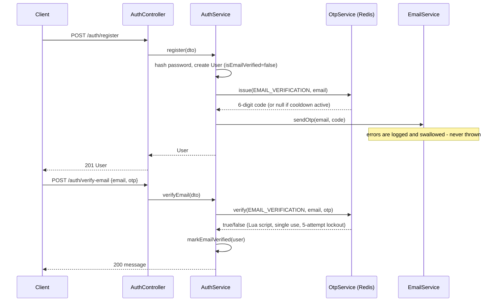
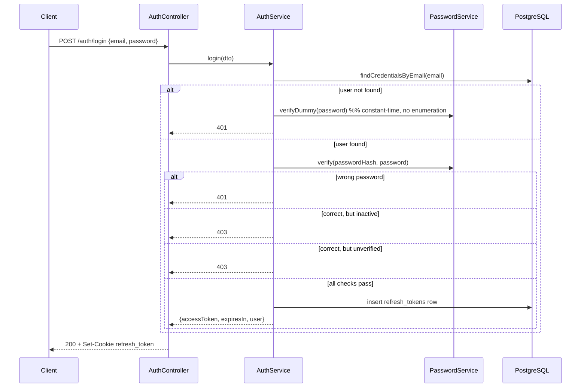
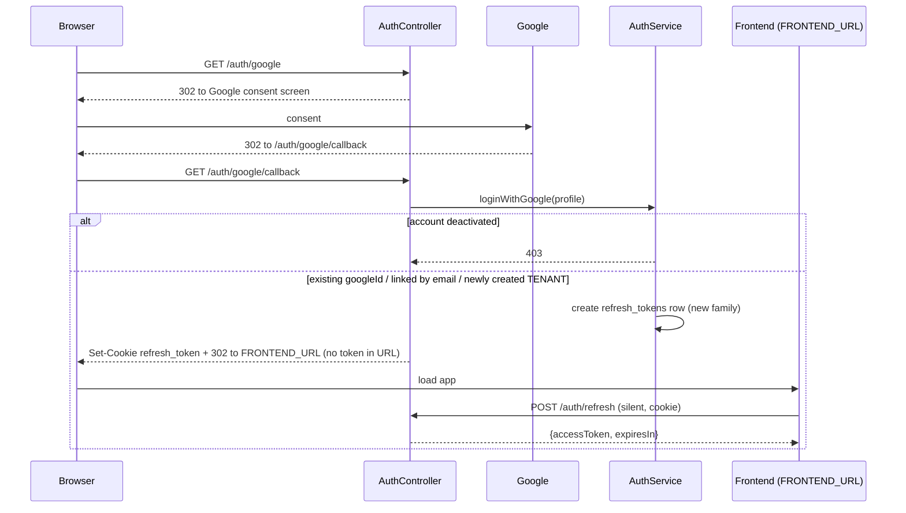
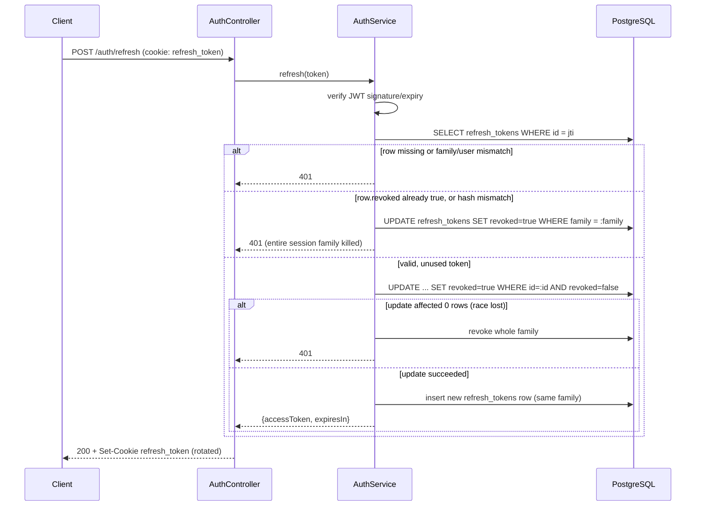
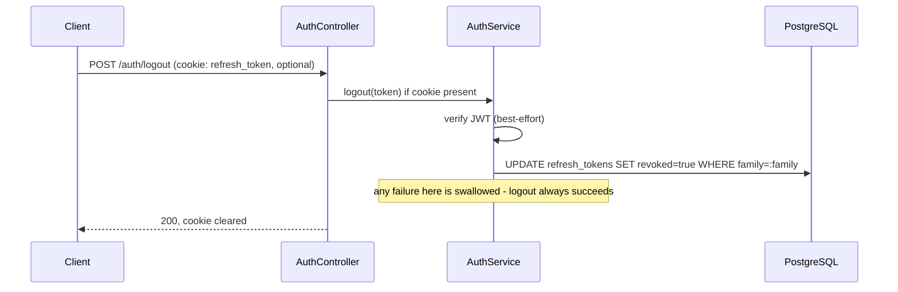

# Authentication

All authentication logic lives in `src/auth/` (`AuthController`, `AuthService`, `PasswordService`, `OtpService`) plus the `RefreshToken` entity and, optionally, `GoogleStrategy`. Every route under `/auth` is `@Public()` (it bypasses `JwtAuthGuard`) and the group is rate-limited together (see "Rate limiting").

## Endpoint summary

| Method & path                         | Body / notes                                                                 | Success                                                  | Errors                                |
| ------------------------------------- | ---------------------------------------------------------------------------- | -------------------------------------------------------- | ------------------------------------- |
| `POST /auth/register`                 | `{email, password (8-128), firstName, lastName, phone?, role: TENANT\|OWNER}` | `201`, created user message                              | `400`, `409` duplicate email          |
| `POST /auth/login`                    | `{email, password}`                                                          | `200` `{accessToken, expiresIn, user}` + refresh cookie  | `401`, `403` deactivated / unverified |
| `POST /auth/refresh`                  | cookie only                                                                  | `200` `{accessToken, expiresIn}` + rotated cookie        | `401` missing / invalid / reused      |
| `POST /auth/logout`                   | cookie if present                                                            | `200` always, clears cookie                              | —                                     |
| `POST /auth/verify-email`             | `{email, otp}`                                                               | `200` message                                            | `400` invalid / expired / locked      |
| `POST /auth/resend-verification-otp`  | `{email}`                                                                    | `200` generic message always                             | —                                     |
| `POST /auth/forgot-password`          | `{email}`                                                                    | `200` generic message always                             | —                                     |
| `POST /auth/reset-password`           | `{email, otp, newPassword}`                                                  | `200` message, revokes all sessions                      | `400`                                 |
| `GET /auth/google`                    | —                                                                            | redirects to Google                                      | —                                     |
| `GET /auth/google/callback`           | —                                                                            | sets the refresh cookie, redirects to `FRONTEND_URL`     | `403` deactivated                     |

## Registration

`POST /auth/register` (`AuthService.register`) accepts `TENANT` or `OWNER` only in the `role` field — `ADMIN` and `MAINTENANCE_STAFF` cannot self-register (the first `ADMIN` comes from the `seed:admin` script; other roles are assigned by an ADMIN). Passwords must be 8 to 128 characters. On success:

1. Rejects if the email already exists (`409`).
2. Hashes the password (see below) and creates the `User` row with `isEmailVerified: false`.
3. Issues an email-verification OTP and sends it. Sending is best-effort: `EmailService.sendOtp` never throws, so a mail failure (SMTP error, missing template, bad credentials) does not fail the request. The API still returns `201`, and the failure is visible only in the server logs. See "Email delivery and failure behavior" below.

## Password hashing

`PasswordService.hash` / `PasswordService.verify`:

- The raw password is first hashed with SHA-256 (`node:crypto`), producing a fixed-length input. This is done because `bcrypt` silently ignores any bytes past the first 72, and multi-byte (e.g. non-Latin) characters would otherwise let an attacker's password collide with a truncated version of the real one.
- The SHA-256 digest is then hashed with `bcrypt` at cost factor 12.
- `verifyDummy(password)` hashes a random value once and reuses it to run a real `bcrypt.compare` even when the email does not exist, so that the response time for "wrong password" and "unknown email" is not distinguishable (`AuthService.login`).

## Access tokens

- Signed with `JWT_ACCESS_SECRET`, algorithm `HS256`.
- Payload: `{ sub: userId }` only.
- Lifetime: `JWT_ACCESS_EXPIRES_IN` (default `15m`).
- Verified on every request by `JwtAuthGuard`, which also re-loads the `User` from the database and rejects (`401`) if the account is no longer `isActive` — deactivation therefore takes effect immediately, not only at the next login.

## Refresh tokens

- Signed with a **separate** secret, `JWT_REFRESH_SECRET`. Both JWT secrets (and `OTP_SECRET`) must be at least 32 characters, and the two JWT secrets must differ; `zod` validation at startup refuses to boot otherwise.
- Payload: `{ sub: userId, jti, family }`.
- Persisted server-side in the `refresh_tokens` table: `id` (equal to the JWT's `jti`), `userId`, `family`, `tokenHash` (SHA-256 of the raw token — the raw token itself is never stored), `expiresAt`, `revoked`. Rows are removed with their user (`ON DELETE CASCADE`).
- Delivered to the client **only** as an httpOnly cookie (`refresh_token`, path `/api/v1/auth`), never in a JSON response body.
- Cookie flags: `secure: true, sameSite: 'none'` when `NODE_ENV=production`; `secure: false, sameSite: 'lax'` in development (assumes a same-site dev proxy).
- Lifetime: `JWT_REFRESH_EXPIRES_IN` (default `7d`).

## Token rotation and reuse detection

Every call to `POST /auth/refresh` (`AuthService.refresh`) performs the following. Steps 1-3 are plain reads and checks; only steps 4-5 run inside a database transaction:

1. Verify the JWT signature/expiry and look up the `refresh_tokens` row by `jti`.
2. Reject if the row is missing, or `userId`/`family` do not match the token's claims.
3. Reject and **revoke the entire family** if the row is already `revoked`, or if the stored hash does not match the presented token (`safeEqual`, constant-time comparison) — this is the reuse-detection path: a token that was already rotated once being presented again is treated as a stolen/replayed token.
4. Otherwise, conditionally flip `revoked: false -> true` on that row (`WHERE id = :id AND revoked = false`), so that two concurrent refresh calls for the same token cannot both succeed; the loser sees `affected: 0` and the whole family is revoked as a reuse case.
5. Issue a brand-new access/refresh pair sharing the same `family`.

This means a refresh token is single-use: using it produces a new token and permanently invalidates the old one, and any later reuse of the old one kills every token in that login session. A missing, invalid or reused cookie returns `401`.

## Logout

`POST /auth/logout` is idempotent: if a refresh cookie is present, its `family` is marked revoked; if not, the endpoint still returns `200`. The cookie is cleared either way.

## Email verification

- A 6-digit code is generated with `crypto.randomInt`, HMAC-SHA256-hashed with `OTP_SECRET`, and stored in Redis under `otp:EMAIL_VERIFICATION:{email}` with a 10-minute TTL (`OtpService`, see `redis.md`).
- `POST /auth/verify-email` checks the code via an atomic Lua script: a correct code deletes the key (single use); an incorrect one increments an attempt counter; the fifth wrong attempt deletes the key even though the real code was never entered. Invalid, expired and locked-out codes all return `400`.
- `POST /auth/resend-verification-otp` always returns the same generic message, and is rate-limited by a separate 60-second cooldown key (`SET ... NX`).
- Login is rejected with `403` while `isEmailVerified` is `false`, and also with `403` if the account is deactivated.

## Email delivery and failure behavior

The OTP is stored in Redis **before** the email is sent, and `EmailService.sendOtp` swallows every error. Consequences:

- A delivery failure never surfaces to the client: `register`, `resend-verification-otp` and `forgot-password` still return their normal responses. Check the server logs (`[EmailService] Failed to send ...`) when users report missing codes.
- Because login requires a verified email, a user whose verification email was never delivered cannot log in until a new code reaches them.
- The 60-second resend cooldown applies even if the previous send failed. After fixing the cause, an affected user can request `resend-verification-otp` once the cooldown has passed (the old code also remains valid for up to 10 minutes, but the user never received it).
- Known past incident: on Vercel, the `otp.ejs` template was not included in the function bundle, so every send failed with `ENOENT` while registration kept returning `201`. The fix is `includeFiles` in `vercel.json`; see "Deployment packaging of runtime-read files" in `architecture.md`.
- The SMTP variables (`SMTP_HOST`, `SMTP_PORT`, `SMTP_USER`, `SMTP_PASSWORD`, `MAIL_FROM`) must also be set in the deployment environment, otherwise sends fail after the template is found.

## Password reset

- `POST /auth/forgot-password` and `resend-verification-otp` both return an identical response regardless of whether the email exists, to prevent account enumeration.
- `POST /auth/reset-password` (`{email, otp, newPassword}`) verifies the OTP (purpose `PASSWORD_RESET`), then in one transaction updates `passwordHash` and revokes every non-revoked refresh token belonging to that user — a password reset always ends all existing sessions. A bad or expired code returns `400`.
- The reset code is delivered through the same `EmailService.sendOtp` path, so it is subject to the same silent-failure behavior described above.

## Google OAuth

Implemented with `passport-google-oauth20` behind `GoogleAuthGuard`. Requires `GOOGLE_CLIENT_ID`, `GOOGLE_CLIENT_SECRET` and `GOOGLE_CALLBACK_URL` (only if Google login is used), and always `FRONTEND_URL`.

- `GET /auth/google` redirects to Google's consent screen.
- `GET /auth/google/callback` receives the verified Google profile (`GoogleStrategy.validate`) and calls `AuthService.loginWithGoogle`:
  - If a user with that `googleId` exists, use it.
  - Else if a user with that email exists (registered normally), link the `googleId` to that account.
  - Else create a new `TENANT` user with `isEmailVerified: true` and `passwordHash: null`.
  - A deactivated account is rejected with `403`.
  - Creates the same refresh-token family and httpOnly refresh cookie as a normal login, then **redirects the browser to `FRONTEND_URL`**. No access token is returned and no token is ever placed in the URL; the frontend performs its normal silent `POST /auth/refresh` on load to pick up the session from the cookie.
- A user created only through Google has no password; a subsequent normal `POST /auth/login` attempt for that account fails safely (`bcrypt.compare` against `null` is caught and treated as a mismatch), it does not throw.

## Rate limiting

All `/auth/*` routes share one group limit of 5 requests per minute (per IP), followed by a block period. This is stricter than the global default of 100/min/IP and is enforced by `ThrottlerGuard` backed by `RedisThrottlerStorage`. It applies on top of the per-email OTP cooldown and attempt lockout.

## Token expiration summary

| Token   | Secret               | Default lifetime | Where enforced                                                                                                |
| ------- | -------------------- | ---------------- | ------------------------------------------------------------------------------------------------------------- |
| Access  | `JWT_ACCESS_SECRET`  | 15 minutes       | `JwtAuthGuard`, on every request                                                                              |
| Refresh | `JWT_REFRESH_SECRET` | 7 days           | JWT `exp` claim **and** the `refresh_tokens.expiresAt` column, checked independently in `AuthService.refresh` |

## Sequence diagrams

### Register and verify email

### Login

### Google sign-in

### Refresh rotation and reuse detection

### Logout

## Verify

- When Google sign-in links a `googleId` to an existing password-registered account, confirm in `AuthService.loginWithGoogle` whether `isEmailVerified` is also set to `true` (Google has verified the address) or left unchanged.
- The exact `400` vs `401` behavior for malformed bodies on `login` and `refresh` follows the README's endpoint table; confirm against the final DTOs and `AllExceptionsFilter`.