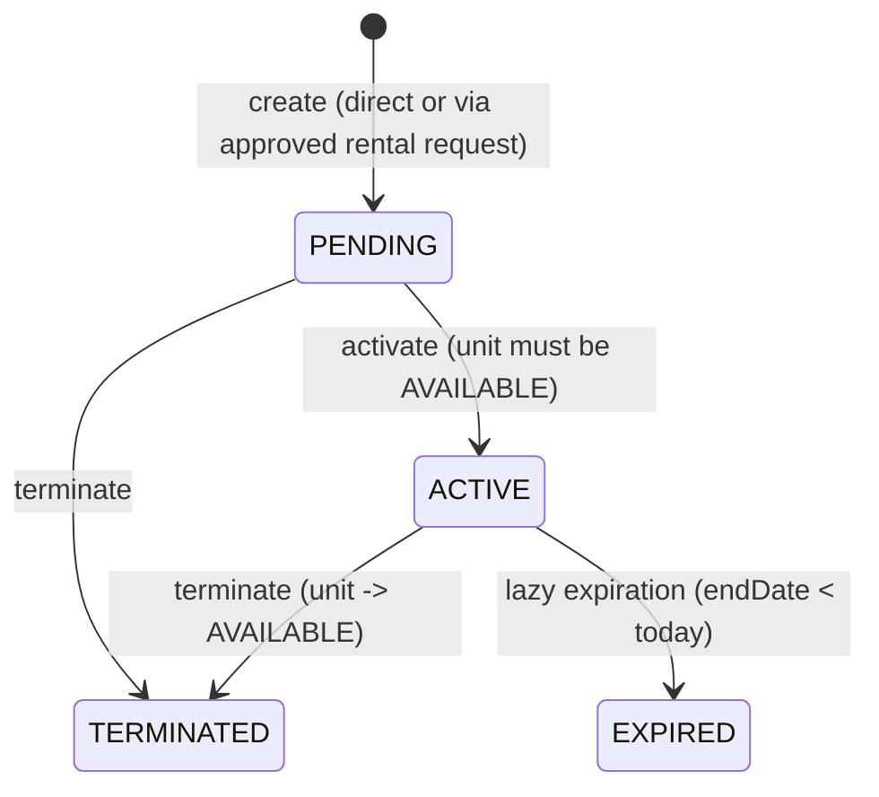
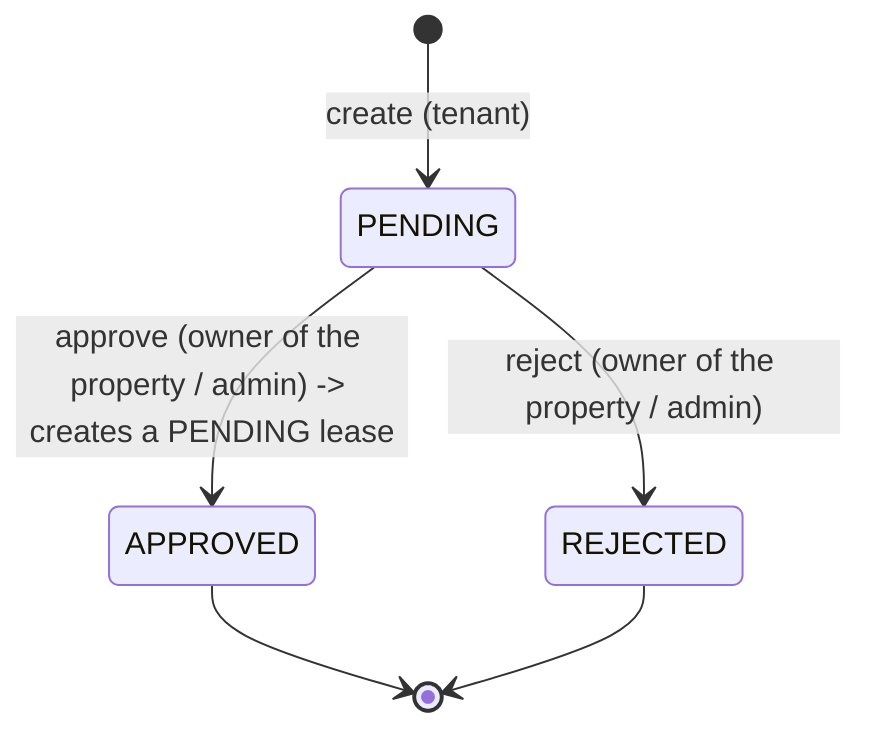
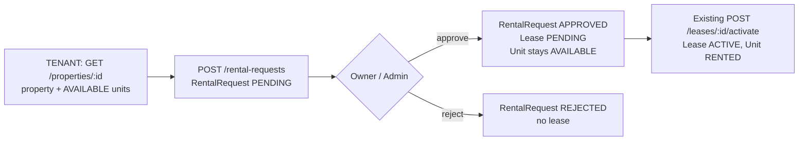
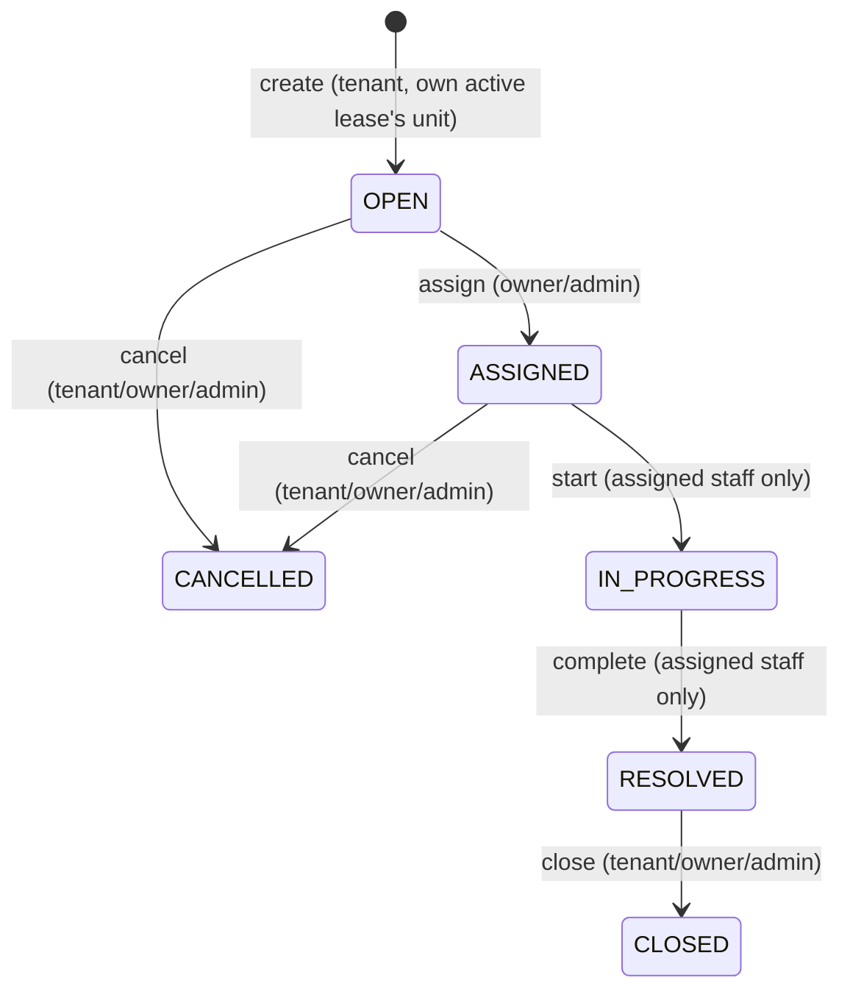

# Business Logic

This document describes the rules implemented per domain, beyond plain CRUD.

## Users

- Four roles; only `TENANT` and `OWNER` are reachable through self-registration (`RegisterDto.role` is restricted to those two).
- `UsersService.setStatus` / `setRole`: an `ADMIN` cannot deactivate or change the role of their **own** account (`422 UnprocessableEntityException`) — this prevents an admin from locking themselves out.
- Both operations run inside a transaction that also writes an `AuditLog` row (`USER_STATUS_CHANGED` / `ROLE_CHANGED`), including the previous/new value in `metadata` and the caller's IP.
- Avatar upload replaces any previous avatar and deletes the old Cloudinary asset (`UsersService.setAvatar`); removal deletes the Cloudinary asset and clears the column.

## Properties

- `PropertiesService.create`: a non-admin caller's `ownerId` input is silently ignored — the owner is always the caller. An `ADMIN` may set `ownerId` explicitly, but only to an existing, active user with the `OWNER` role (`400` otherwise).
- **Tenant access**: a `TENANT` can list all properties (`GET /properties`) and open any property (`GET /properties/:id`). For a tenant, `PropertiesService.findForActor` returns the property together with **only its `AVAILABLE` units** (`RENTED` and `MAINTENANCE` units are never exposed). This is the only tenant-facing way to discover rentable units — there is no separate browse endpoint, and `GET /units` remains restricted to `OWNER`/`ADMIN`. For `OWNER`/`ADMIN`, `findForActor` still enforces ownership via `canManageProperty` (`403` otherwise). Write operations (`update`, `remove`, image changes) also go through `findForActor`, but their routes are restricted to `OWNER`/`ADMIN` by `@Roles`.
- Soft delete only (`deletedAt`), and rejected with `409` if any unit of the property currently has status `RENTED` — a property with active tenants cannot be removed.
- Every create/update/delete/image-change invalidates the `dashboard:stats:*` cache pattern (see `redis.md`); create and delete additionally write an `AuditLog` row inside the same transaction as the database write.
- Image limit is enforced additively (`existing.length + incoming.length <= PROPERTY_MAX_IMAGES`), not just per-request.

## Units

- Composite uniqueness `(propertyId, building, unitNumber)` prevents duplicate unit identifiers within a property.
- `status` has a restricted manual state machine: `AVAILABLE <-> MAINTENANCE` only, through `PATCH /units/:id/status`. Any attempt to set `RENTED` manually is rejected at the DTO level (the DTO's allowed values are `AVAILABLE`/`MAINTENANCE` only). If the unit is currently `RENTED`, any manual status change is rejected with `400` regardless of the requested target — only the lease flow can change a rented unit's status.
- `GET /units/:id` is also open to a `TENANT`, restricted to `AVAILABLE` units. `GET /units` (search) stays `OWNER`/`ADMIN` only.
- A unit stays `AVAILABLE` while it only has `PENDING` leases (including leases produced by approving a rental request). It becomes `RENTED` only when a lease is activated.
- Every unit search (`GET /units`) first runs `LeaseExpirationService.run()` (see below), so a unit whose lease has just lapsed is reported as `AVAILABLE` even before any write touches it.
- Status changes are transactional and write an `AuditLog` row (`UNIT_STATUS_CHANGED`, with `previousStatus`/`newStatus` in `metadata`), and invalidate both the unit-search cache and the dashboard cache.
- Each unit carries a `rentAmount` (the current asking rent). It is copied — never referenced — onto rental requests and leases, so later rent changes do not alter existing requests or leases.

## Leases

State machine:

- **Creation**: a lease is created either directly (`POST /leases`) or by approving a rental request (see the next section). Both paths yield a `PENDING` lease that follows the same lifecycle afterwards. For the direct path, the target unit must belong to the caller (OWNER) or the caller is ADMIN — enforced by reusing `UnitsService.findForActor`. `tenantId` must reference an active user with role `TENANT` (`400` otherwise). `startDate` must be strictly before `endDate` (checked in the service, and again by the database `CHECK` constraint). Overlap with another `PENDING`/`ACTIVE` lease of the same unit is rejected by the database's `EXCLUDE` constraint and surfaces as `409`.
- **Update**: only while `PENDING` (`409` otherwise); the exclusion constraint is re-validated by PostgreSQL on the `UPDATE` itself, so a date change that creates a new overlap is still rejected.
- **Activation**: requires the lease to be `PENDING` and the unit to be `AVAILABLE`; both rows are locked with `SELECT ... FOR UPDATE` (`pessimistic_write`) inside one transaction before either check, so two concurrent activation attempts on leases for the same unit cannot both succeed. Activation logic is unchanged by the rental request feature.
- **Termination**: allowed from `PENDING` or `ACTIVE`. If the lease was `ACTIVE`, the unit is released back to `AVAILABLE` in the same transaction.
- **Expiration is lazy, not scheduled.** `LeaseExpirationService.run()` executes a single set-based `UPDATE leases ... WHERE status='ACTIVE' AND endDate < CURRENT_DATE`, then frees the corresponding units, in one transaction. It runs before every lease read/write, before every rental request creation and approval, and before every unit search. There is no cron job or background worker; the invariant "no overdue lease reports itself as ACTIVE" holds because every code path that reads lease/unit state calls this first.
- **Side effects**: direct creation, activation, and termination each write a `Notification` to the tenant and an `AuditLog` row, inside the same transaction as the state change. Activation and termination (and any run of the lazy-expiration sweep that changes rows) then invalidate both cache patterns (`units:search:*`, `dashboard:stats:*`) after the transaction commits, never inside it, since Redis participates in neither the transaction nor its rollback. Creating a `PENDING` lease does not invalidate any cache, because it changes neither unit occupancy nor unit status.

## Rental requests

State machine:

**Why `RentalRequestResponseDto` nests `tenant`/`unit` summaries while `Lease`/`Property` responses only expose IDs**: this is deliberate, not an inconsistency to fix. An owner reviewing a `PENDING` rental request needs to recognize the tenant (name, phone) and the unit (number, building) _before_ deciding to approve or reject — without it, they'd need a second round-trip per request just to render a decision screen. Leases and properties don't carry this requirement at read time since their own detail/list pages already have the full related object loaded through their own fetch.

There is no `CANCELLED` status. `APPROVED` and `REJECTED` are terminal.

Overall lifecycle:

- **Creation (`POST /rental-requests`, `TENANT` only)**: `tenantId` is always the authenticated user and `status` is always `PENDING`. Neither may appear in the body — the global `ValidationPipe` (`whitelist` + `forbidNonWhitelisted`) rejects them with `400`, and the service ignores them regardless. Dates must be `YYYY-MM-DD` strings that are real calendar dates (`2026-02-31` is rejected) with `startDate < endDate` (`400`). The backend does not trust what the UI displayed: it runs `LeaseExpirationService.run()`, loads the unit and its property (`404` if the unit does not exist or its property is soft-deleted), requires the unit to be `AVAILABLE` (`409`), and rejects the request (`409`) if a `PENDING` or `ACTIVE` lease of that unit overlaps the requested range. The overlap check uses inclusive bounds, matching the lease exclusion constraint (`daterange(startDate, endDate, '[]')`). The unit's current `rentAmount` is copied onto the request. The request, the owner notification and the audit row are written in one transaction.
- **A request does not reserve the unit.** Because `AVAILABLE` can coexist with a `PENDING` lease, the availability check at creation is an early, best-effort filter only. There is deliberately no uniqueness or overlap constraint on `rental_requests`, so several pending requests — even from the same tenant, for the same dates — may exist; the conflict is decided at approval time by the lease constraints.
- **Visibility and resource-level authorization**: `TENANT` sees and opens only their own requests; `OWNER` only requests whose unit belongs to a property they own (`request -> unit -> property -> ownerId`); `ADMIN` sees all. List endpoints apply this filter in the SQL query (`tenantId = :self` / `property.ownerId = :owner`), never by filtering in memory. Single-request reads use `canAccessRentalRequest` (`403` when denied, `404` when the request or its property does not exist). Approve and reject use the existing `canManageProperty` policy, so an owner cannot act on another owner's request even with its ID (IDOR protection). Responses expose only `tenant { id, firstName, lastName, phone }` and `unit { id, unitNumber, building, propertyId }` alongside the request fields, via `RentalRequestResponseDto.fromEntity`, never the raw `User`/`Unit` entities.
- **Approval (`POST /rental-requests/:id/approve`, `OWNER`/`ADMIN`)** runs in one transaction, in this order: (1) lock the request row with `pessimistic_write` (no joins, since `FOR UPDATE` cannot target the nullable side of an outer join), (2) load the unit and property and verify the caller may manage it (`403`), (3) require status `PENDING` (`409`), (4) lock the unit row with `pessimistic_write`, which serializes concurrent approvals for the same unit, and require it to still be `AVAILABLE` (`409`), (5) require the requesting tenant to still be an active `TENANT` (`409`), (6) re-check the date overlap against `PENDING`/`ACTIVE` leases (`409`), (7) create a `PENDING` lease from the request's `tenantId`, `unitId`, dates and `rentAmount`, (8) set the request to `APPROVED`, (9) write one `RENTAL_REQUEST_APPROVED` notification to the tenant, (10) write one `RENTAL_REQUEST_APPROVED` audit row (with `leaseId` and `unitId` in `metadata`). The lease is inserted directly with the transaction's manager rather than via `LeasesService.create`, so approval emits exactly one notification and one audit entry instead of also producing `LEASE_CREATED` ones, and `LeasesService` stays unchanged.
- **Approval never changes the unit's status** and never calls or duplicates lease activation. The unit becomes `RENTED` only when the existing `POST /leases/:id/activate` runs.
- **Concurrency safety**: the row locks serialize approvals of the same unit, but a direct `POST /leases` does not take the unit lock, so the lease exclusion constraint remains the final backstop. If PostgreSQL rejects the lease insert (`23P01` exclusion or `23505` unique), the transaction rolls back — the request stays `PENDING`, no lease, notification or audit row persists — and `AllExceptionsFilter` maps the error to `409`. The lock order (request, then unit) cannot deadlock with activation (lease, then unit), because approval never locks a lease row.
- **Rejection (`POST /rental-requests/:id/reject`, `OWNER`/`ADMIN`)**: locks the request row, verifies authorization, requires `PENDING` (`409` otherwise), sets `REJECTED`, notifies the tenant (`RENTAL_REQUEST_REJECTED`) and writes a `RENTAL_REQUEST_REJECTED` audit row, all in one transaction. No lease is created and the unit is not touched.
- **State rules apply to everyone**: `ADMIN` bypasses ownership checks but not state rules or lease constraints — an `APPROVED` or `REJECTED` request cannot be approved or rejected again (`409`), and a tenant can never approve or reject.
- **Stale pending requests**: when one request is approved, other pending requests for overlapping dates stay `PENDING`; approving one of them fails with `409` once the dates conflict with the new lease, and the owner can reject it.
- **Side effects and caching**: creation notifies the property owner (`RENTAL_REQUEST_CREATED`) and writes a `RENTAL_REQUEST_CREATED` audit row, in the same transaction as the insert. No cache is invalidated by any rental request operation, because none of them changes unit status or occupancy; the `PENDING` lease created by an approval affects the caches only when it is activated (which already invalidates them).

## Maintenance

State machine:

- **Creation**: the unit is derived from the caller's own currently `ACTIVE` lease (`LeasesService.findActiveLeaseForTenant`) — never accepted as client input, which prevents a tenant from filing a request against a unit they do not occupy. `400` if no active lease exists. Up to 5 images, validated by content (see `security.md`).
- **Assignment**: requires the request to be `OPEN` and the caller to manage the unit's property (owner or admin); the target `assignedStaffId` must reference an active `MAINTENANCE_STAFF` user (`400` otherwise).
- **Start / Complete**: restricted to `request.assignedStaffId === actor.id` exactly — a direct equality check, not one of the general policy functions, and **not** overridable by `ADMIN`. `complete` requires `resolutionDescription` and accepts up to 5 completion images; it sets `resolvedAt`. Completion images are uploaded to Cloudinary **before** the database transaction opens, so a slow external network call never holds a row lock.
- **Close / Cancel**: `close` only from `RESOLVED`; `cancel` only from `OPEN` or `ASSIGNED`; both allowed for the tenant, the property owner, or `ADMIN` — explicitly not `MAINTENANCE_STAFF`.
- **Status history**: every transition performed via `assign`/`start`/`complete`/`close`/`cancel` inserts one `MaintenanceStatusHistory` row (`previousStatus`, `newStatus`, `changedById`, optional `notes`) inside the same transaction as the status update. Creation does not produce a history row.
- **Notifications and audit**: `create` notifies the property owner; `assign` notifies both the assigned staff member and the tenant, and writes an audit row; `complete` notifies both the tenant and the owner, and writes an audit row. `start`, `close`, and `cancel` do neither, by design.
- **Image removal**: request images can only be removed while `OPEN`; completion images only while `RESOLVED`, and only by the assigned staff member.

## Notifications

- Always scoped to `recipientId === caller.id` — there is no cross-user notification listing, for any role including `ADMIN`.
- Types: `LEASE_CREATED`, `LEASE_ACTIVATED`, `LEASE_TERMINATED`, `RENTAL_REQUEST_CREATED`, `RENTAL_REQUEST_APPROVED`, `RENTAL_REQUEST_REJECTED`, `MAINTENANCE_CREATED`, `MAINTENANCE_ASSIGNED`, `MAINTENANCE_RESOLVED`. Rental request notifications carry `relatedEntityType = 'RentalRequest'` and the request's ID.
- `GET /notifications` supports an `unread` filter and always returns `meta.unreadCount` (a separate `COUNT` query, not derived from the current page).
- `PATCH /:id/read` is scoped by both `id` and `recipientId` in the same `UPDATE` — attempting to mark another user's notification as read affects zero rows and returns `404`, rather than leaking whether the ID exists.

## Audit logs

- Append-only from the application's perspective — no update or delete endpoint exists.
- `ADMIN`-only read access, filterable by `action`, `entity`, `userId`.
- Recorded actions: `PROPERTY_CREATED`, `PROPERTY_DELETED`, `LEASE_CREATED`, `LEASE_ACTIVATED`, `LEASE_TERMINATED`, `RENTAL_REQUEST_CREATED`, `RENTAL_REQUEST_APPROVED`, `RENTAL_REQUEST_REJECTED`, `UNIT_STATUS_CHANGED`, `MAINTENANCE_ASSIGNED`, `MAINTENANCE_COMPLETED`, `USER_STATUS_CHANGED`, `ROLE_CHANGED`.
- Every write happens inside the same transaction as the business operation it records (see `transactions.md`), using the transaction's own `EntityManager`, never a separate connection — a rolled-back operation therefore never leaves a stray audit entry.

## Analytics

- A single endpoint, `GET /analytics/dashboard`, scoped: `OWNER` sees only their own properties' aggregates; `ADMIN` sees system-wide numbers.
- Computed with raw aggregate queries (`COUNT(*) FILTER (WHERE ...)`, `AVG(...)`) across `Property`, `Unit`, `Lease`, and `MaintenanceRequest`, joined through to the owning property when scoping to a specific `OWNER`. Rental requests are not part of the dashboard statistics.
- Also calls `LeaseExpirationService.run()` first, so the numbers reflect any leases that lapsed since the last read.
- Result is cached per scope (`dashboard:stats:admin` or `dashboard:stats:owner:<id>`) with a 60-second TTL, invalidated by the writes enumerated in `redis.md`.
