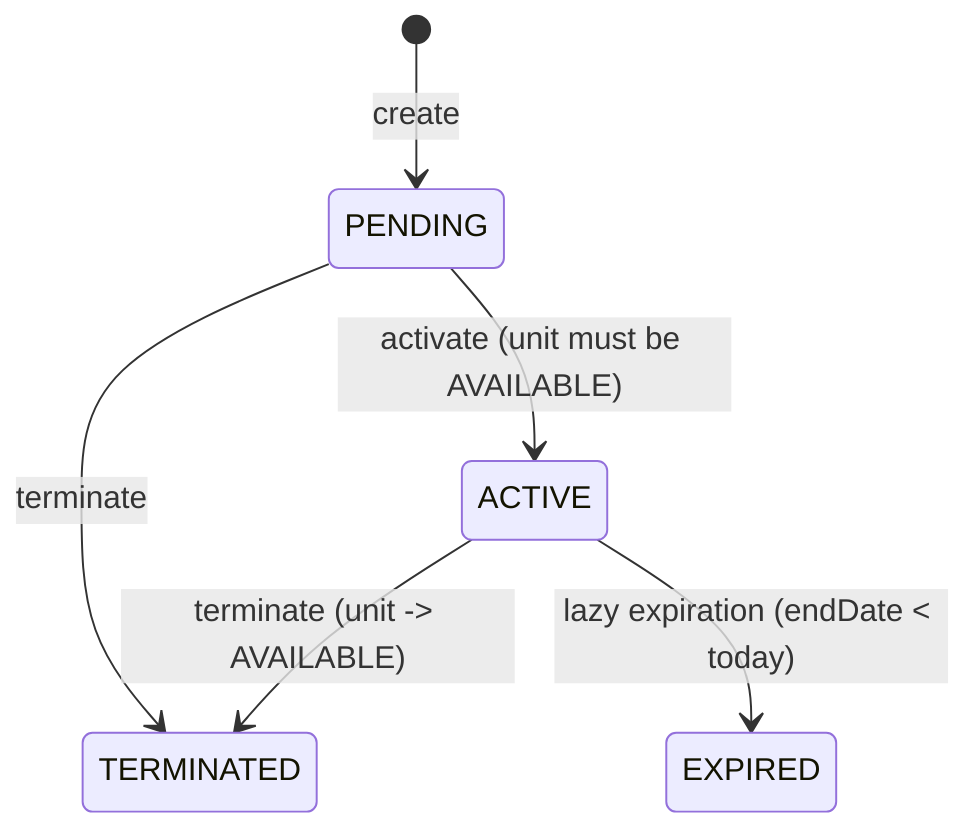
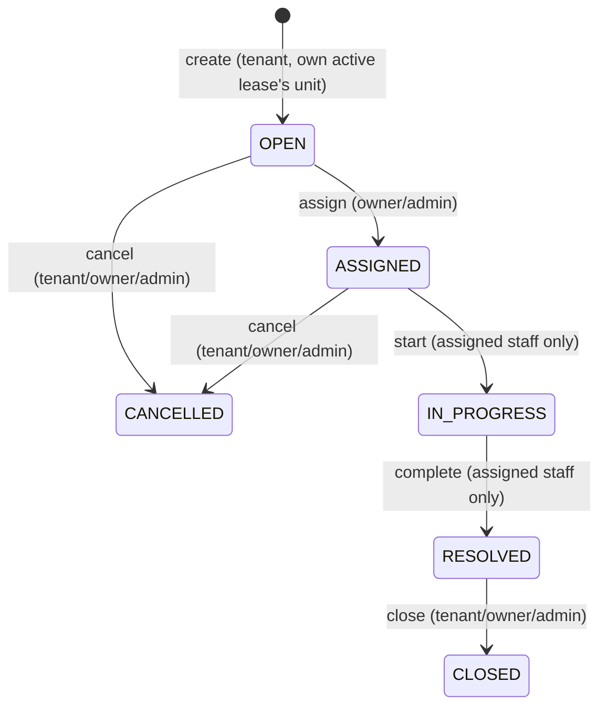

# Business Logic

This document describes the rules implemented per domain, beyond plain CRUD.

## Users

- Four roles; only `TENANT` and `OWNER` are reachable through self-registration (`RegisterDto.role` is restricted to those two).
- `UsersService.setStatus` / `setRole`: an `ADMIN` cannot deactivate or change the role of their **own** account (`422 UnprocessableEntityException`) — this prevents an admin from locking themselves out.
- Both operations run inside a transaction that also writes an `AuditLog` row (`USER_STATUS_CHANGED` / `ROLE_CHANGED`), including the previous/new value in `metadata` and the caller's IP.
- Avatar upload replaces any previous avatar and deletes the old Cloudinary asset (`UsersService.setAvatar`); removal deletes the Cloudinary asset and clears the column.

## Properties

- `PropertiesService.create`: a non-admin caller's `ownerId` input is silently ignored — the owner is always the caller. An `ADMIN` may set `ownerId` explicitly, but only to an existing, active user with the `OWNER` role (`400` otherwise).
- Soft delete only (`deletedAt`), and rejected with `409` if any unit of the property currently has status `RENTED` — a property with active tenants cannot be removed.
- Every create/update/delete/image-change invalidates the `dashboard:stats:*` cache pattern (see `redis.md`); create and delete additionally write an `AuditLog` row inside the same transaction as the database write.
- Image limit is enforced additively (`existing.length + incoming.length <= PROPERTY_MAX_IMAGES`), not just per-request.

## Units

- Composite uniqueness `(propertyId, building, unitNumber)` prevents duplicate unit identifiers within a property.
- `status` has a restricted manual state machine: `AVAILABLE <-> MAINTENANCE` only, through `PATCH /units/:id/status`. Any attempt to set `RENTED` manually is rejected at the DTO level (the DTO's allowed values are `AVAILABLE`/`MAINTENANCE` only). If the unit is currently `RENTED`, any manual status change is rejected with `400` regardless of the requested target — only the lease flow can change a rented unit's status.
- Every unit search (`GET /units`) first runs `LeaseExpirationService.run()` (see below), so a unit whose lease has just lapsed is reported as `AVAILABLE` even before any write touches it.
- Status changes are transactional and write an `AuditLog` row (`UNIT_STATUS_CHANGED`, with `previousStatus`/`newStatus` in `metadata`), and invalidate both the unit-search cache and the dashboard cache.

## Leases

State machine:

- **Creation**: the target unit must belong to the caller (OWNER) or the caller is ADMIN — enforced by reusing `UnitsService.findForActorOrFail`. `tenantId` must reference an active user with role `TENANT` (`400` otherwise). `startDate` must be strictly before `endDate` (checked in the service, and again by the database `CHECK` constraint). Overlap with another `PENDING`/`ACTIVE` lease of the same unit is rejected by the database's `EXCLUDE` constraint and surfaces as `409`.
- **Update**: only while `PENDING` (`409` otherwise); the exclusion constraint is re-validated by PostgreSQL on the `UPDATE` itself, so a date change that creates a new overlap is still rejected.
- **Activation**: requires the lease to be `PENDING` and the unit to be `AVAILABLE`; both rows are locked with `SELECT ... FOR UPDATE` (`pessimistic_write`) inside one transaction before either check, so two concurrent activation attempts on leases for the same unit cannot both succeed.
- **Termination**: allowed from `PENDING` or `ACTIVE`. If the lease was `ACTIVE`, the unit is released back to `AVAILABLE` in the same transaction.
- **Expiration is lazy, not scheduled.** `LeaseExpirationService.run()` executes a single set-based `UPDATE leases ... WHERE status='ACTIVE' AND endDate < CURRENT_DATE`, then frees the corresponding units, in one transaction. It runs before every lease read/write and before every unit search. There is no cron job or background worker; the invariant "no overdue lease reports itself as ACTIVE" holds because every code path that reads lease/unit state calls this first.
- **Side effects**: creation, activation, and termination each write a `Notification` to the tenant and an `AuditLog` row, inside the same transaction as the state change. Activation and termination (and any run of the lazy-expiration sweep that changes rows) then invalidate both cache patterns (`units:search:*`, `dashboard:stats:*`) after the transaction commits, never inside it, since Redis participates in neither the transaction nor its rollback. Creating a `PENDING` lease does not invalidate any cache, because it changes neither unit occupancy nor unit status.

## Maintenance

State machine:

- **Creation**: the unit is derived from the caller's own currently `ACTIVE` lease (`LeasesService.findActiveLeaseForTenant`) — never accepted as client input, which prevents a tenant from filing a request against a unit they do not occupy. `400` if no active lease exists. Up to 5 images, validated by content (see `security.md`).
- **Assignment**: requires the request to be `OPEN` and the caller to manage the unit's property (owner or admin); the target `assignedStaffId` must reference an active `MAINTENANCE_STAFF` user (`400` otherwise).
- **Start / Complete**: restricted to `request.assignedStaffId === actor.id` exactly — a direct equality check, not one of the general policy functions, and **not** overridable by `ADMIN`. `complete` requires `resolutionDescription` and accepts up to 5 completion images; it sets `resolvedAt`. Completion images are uploaded to Cloudinary **before** the database transaction opens, so a slow external network call never holds a row lock.
- **Close / Cancel**: `close` only from `RESOLVED`; `cancel` only from `OPEN` or `ASSIGNED`; both allowed for the tenant, the property owner, or `ADMIN` — explicitly not `MAINTENANCE_STAFF`.
- **Status history**: every transition performed via `assign`/`start`/`complete`/`close`/`cancel` inserts one `MaintenanceStatusHistory` row (`previousStatus`, `newStatus`, `changedById`, optional `notes`) inside the same transaction as the status update. Creation does not produce a history row.
- **Notifications and audit**: `create` notifies the property owner; `assign` notifies both the assigned staff member and the tenant, and writes an audit row; `complete` notifies both the tenant and the owner, and writes an audit row. `start`, `close`, and `cancel` do neither, by design.
- **Image removal**: request images can only be removed while `OPEN`; completion images only while `RESOLVED`, and only by the assigned staff member.

## Notifications

- Always scoped to `recipientId === caller.id` — there is no cross-user notification listing, for any role including `ADMIN`.
- `GET /notifications` supports an `unread` filter and always returns `meta.unreadCount` (a separate `COUNT` query, not derived from the current page).
- `PATCH /:id/read` is scoped by both `id` and `recipientId` in the same `UPDATE` — attempting to mark another user's notification as read affects zero rows and returns `404`, rather than leaking whether the ID exists.

## Audit logs

- Append-only from the application's perspective — no update or delete endpoint exists.
- `ADMIN`-only read access, filterable by `action`, `entity`, `userId`.
- Every write happens inside the same transaction as the business operation it records (see `transactions.md`), using the transaction's own `EntityManager`, never a separate connection — a rolled-back operation therefore never leaves a stray audit entry.

## Analytics

- A single endpoint, `GET /analytics/dashboard`, scoped: `OWNER` sees only their own properties' aggregates; `ADMIN` sees system-wide numbers.
- Computed with raw aggregate queries (`COUNT(*) FILTER (WHERE ...)`, `AVG(...)`) across `Property`, `Unit`, `Lease`, and `MaintenanceRequest`, joined through to the owning property when scoping to a specific `OWNER`.
- Also calls `LeaseExpirationService.run()` first, so the numbers reflect any leases that lapsed since the last read.
- Result is cached per scope (`dashboard:stats:admin` or `dashboard:stats:owner:<id>`) with a 60-second TTL, invalidated by the writes enumerated in `redis.md`.
