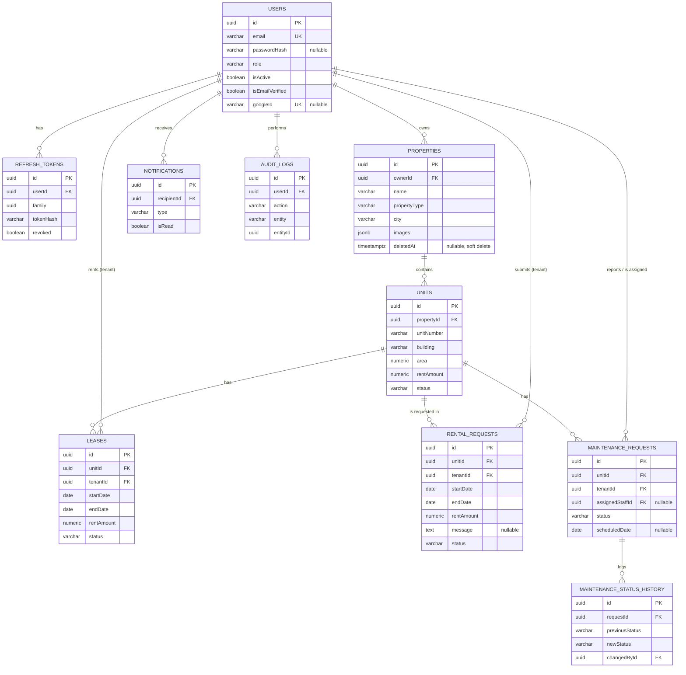

# Database

PostgreSQL, accessed exclusively through TypeORM. `synchronize` is `false` in every environment; the schema is defined entirely by `src/database/migrations/*` and is expected to be applied with `npm run migration:run`.

## Entities

### `User` (`users`)

- `id` (uuid, PK), `email` (unique), `passwordHash` (nullable — null for Google-only accounts, `select: false` by default), `firstName`, `lastName`, `phone` (nullable), `role` (enum, default `TENANT`), `isActive` (default `true`), `isEmailVerified` (default `false`), `avatar` (jsonb `{url, publicId}`, nullable), `googleId` (unique, nullable), `createdAt`, `updatedAt`.

### `RefreshToken` (`refresh_tokens`)

- `id` (uuid PK, equals the JWT `jti`), `userId` (FK -> `users`, `CASCADE`), `family` (uuid), `tokenHash` (sha256 hex), `expiresAt`, `revoked` (default `false`), `createdAt`.
- Indexes: `userId`, `family`.

### `Property` (`properties`)

- `id`, `name`, `description` (nullable), `propertyType` (enum), `address`, `city`, `country`, `ownerId` (FK -> `users`, `CASCADE`), `images` (jsonb array, default `[]`), `createdAt`, `updatedAt`, `deletedAt` (soft delete).
- Indexes: `propertyType`, `city`, `ownerId`.

### `Unit` (`units`)

- `id`, `unitNumber`, `building`, `floor` (nullable), `area` (numeric 10,2), `rentAmount` (numeric 10,2 — the unit's current asking rent), `bedrooms` (smallint), `bathrooms` (smallint), `description` (nullable), `propertyId` (FK -> `properties`, `CASCADE`), `status` (enum, default `AVAILABLE`), `createdAt`, `updatedAt`.
- Constraint: `UNIQUE (propertyId, building, unitNumber)`.
- Indexes: `bedrooms`, `propertyId`, `status`.

### `Lease` (`leases`)

- `id`, `tenantId` (FK -> `users`, `RESTRICT`), `unitId` (FK -> `units`, `RESTRICT`), `startDate`, `endDate` (both `date`), `rentAmount` (numeric 10,2 — copied at creation time, not a reference to the unit's current rent), `status` (enum, default `PENDING`), `notes` (nullable), `createdAt`, `updatedAt`.
- `CHECK ("startDate" < "endDate")`.
- `EXCLUDE USING gist ("unitId" WITH =, daterange("startDate","endDate",'[]') WITH &&) WHERE (status IN ('PENDING','ACTIVE'))` — requires the `btree_gist` extension; enforces that no two PENDING/ACTIVE leases of the same unit can have overlapping date ranges, at the database level, under concurrent writes. This is also the final concurrency guard for rental request approval.
- Partial unique index: `UNIQUE (unitId) WHERE status = 'ACTIVE'` — at most one active lease per unit.
- Indexes: `(status, endDate)` composite (used by the lazy-expiration query), `tenantId`, `unitId`, `status`.

### `RentalRequest` (`rental_requests`)

- `id` (uuid PK), `tenantId` (FK -> `users`, `RESTRICT`), `unitId` (FK -> `units`, `RESTRICT`), `startDate`, `endDate` (both `date`), `rentAmount` (numeric 10,2 — snapshot of the unit's rent when the request was made, copied to the lease on approval), `message` (nullable text), `status` (enum `PENDING`/`APPROVED`/`REJECTED`, default `PENDING`), `createdAt`, `updatedAt`.
- `CHECK ("startDate" < "endDate")`, mirroring `leases`.
- Indexes: `tenantId`, `unitId`, `status`.
- There is no direct relation to `properties`: a request reaches its property through `unit -> property`, which is what ownership checks and owner-scoped listings join on.
- There is intentionally **no** overlap/exclusion constraint and **no** uniqueness constraint on this table. A request does not reserve a unit, so overlapping and duplicate pending requests are allowed; conflicts are resolved at approval time by the `leases` constraints.

### `MaintenanceRequest` (`maintenance_requests`)

- `id`, `title`, `description`, `category` (enum), `priority` (enum), `images` (jsonb array, default `[]`), `unitId` (FK -> `units`, `RESTRICT`), `tenantId` (FK -> `users`, `RESTRICT`), `status` (enum, default `OPEN`), `assignedStaffId` (FK -> `users`, `RESTRICT`, nullable), `scheduledDate` (nullable date), `completionImages` (jsonb array, default `[]`), `resolutionDescription` (nullable), `resolvedAt` (nullable), `createdAt`, `updatedAt`.
- Indexes: `priority`, `unitId`, `status`, `assignedStaffId`.

### `MaintenanceStatusHistory` (`maintenance_status_history`)

- `id`, `requestId` (FK -> `maintenance_requests`, `CASCADE`), `previousStatus`, `newStatus` (both the maintenance status enum), `changedById` (FK -> `users`, `RESTRICT`), `notes` (nullable), `createdAt`.
- One row is written per transition performed via `assign`/`start`/`complete`/`close`/`cancel` — never on creation, since there is no "previous status" at creation time.

### `Notification` (`notifications`)

- `id`, `recipientId` (FK -> `users`, `CASCADE`), `type` (enum), `title`, `message`, `isRead` (default `false`), `relatedEntityType` (nullable), `relatedEntityId` (nullable uuid), `createdAt`.
- Composite index `(recipientId, isRead)`.

### `AuditLog` (`audit_logs`)

- `id`, `userId` (FK -> `users`, `RESTRICT` — the acting user), `action` (enum), `entity` (varchar, e.g. `"Property"`, `"RentalRequest"`), `entityId` (uuid), `metadata` (jsonb, nullable), `ipAddress` (nullable), `createdAt`.
- Indexes: `userId`, `action`, `entity`.

## Enums

| Enum                  | Values                                                                                                                                                                                                                                                                                        |
| --------------------- | --------------------------------------------------------------------------------------------------------------------------------------------------------------------------------------------------------------------------------------------------------------------------------------------- |
| `UserRole`            | `TENANT`, `OWNER`, `MAINTENANCE_STAFF`, `ADMIN`                                                                                                                                                                                                                                               |
| `PropertyType`        | `APARTMENT`, `VILLA`, `STUDIO`, `TOWNHOUSE`, `COMMERCIAL`, `OTHER`                                                                                                                                                                                                                            |
| `UnitStatus`          | `AVAILABLE`, `RENTED`, `MAINTENANCE`                                                                                                                                                                                                                                                          |
| `LeaseStatus`         | `PENDING`, `ACTIVE`, `TERMINATED`, `EXPIRED`                                                                                                                                                                                                                                                  |
| `RentalRequestStatus` | `PENDING`, `APPROVED`, `REJECTED`                                                                                                                                                                                                                                                             |
| `MaintenanceCategory` | `PLUMBING`, `ELECTRICITY`, `HVAC`, `CARPENTRY`, `APPLIANCES`, `OTHER`                                                                                                                                                                                                                         |
| `MaintenancePriority` | `LOW`, `MEDIUM`, `HIGH`, `URGENT`                                                                                                                                                                                                                                                             |
| `MaintenanceStatus`   | `OPEN`, `ASSIGNED`, `IN_PROGRESS`, `RESOLVED`, `CLOSED`, `CANCELLED`                                                                                                                                                                                                                          |
| `NotificationType`    | `LEASE_CREATED`, `LEASE_ACTIVATED`, `LEASE_TERMINATED`, `MAINTENANCE_CREATED`, `MAINTENANCE_ASSIGNED`, `MAINTENANCE_RESOLVED`, `RENTAL_REQUEST_CREATED`, `RENTAL_REQUEST_APPROVED`, `RENTAL_REQUEST_REJECTED`                                                                                 |
| `AuditAction`         | `PROPERTY_CREATED`, `PROPERTY_DELETED`, `LEASE_CREATED`, `LEASE_ACTIVATED`, `LEASE_TERMINATED`, `UNIT_STATUS_CHANGED`, `MAINTENANCE_ASSIGNED`, `MAINTENANCE_COMPLETED`, `USER_STATUS_CHANGED`, `ROLE_CHANGED`, `RENTAL_REQUEST_CREATED`, `RENTAL_REQUEST_APPROVED`, `RENTAL_REQUEST_REJECTED` |

## Cascade / restrict rationale

| Relationship                                                       | Behavior   | Reason                                                                                                     |
| ------------------------------------------------------------------ | ---------- | ---------------------------------------------------------------------------------------------------------- |
| `RefreshToken -> User`                                             | `CASCADE`  | A deleted user's sessions are meaningless.                                                                 |
| `Property -> User` (owner)                                         | `CASCADE`  | Consistent with the rest of the schema; in practice users are deactivated, not deleted.                    |
| `Unit -> Property`                                                 | `CASCADE`  | A unit cannot exist without its property.                                                                  |
| `Notification -> User`                                             | `CASCADE`  | Notifications are disposable per-user data.                                                                |
| `Lease -> User` (tenant), `Lease -> Unit`                          | `RESTRICT` | Leases are historical/financial records and must not silently disappear if a referenced row is removed.    |
| `RentalRequest -> User` (tenant), `RentalRequest -> Unit`          | `RESTRICT` | Requests are a record of tenant intent and of owner decisions; they must not vanish with a referenced row. |
| `MaintenanceRequest -> Unit`, `-> User` (tenant/staff)             | `RESTRICT` | Same rationale — maintenance history is a record, not disposable state.                                    |
| `MaintenanceStatusHistory -> MaintenanceRequest`                   | `CASCADE`  | History rows have no meaning without their parent request.                                                 |
| `MaintenanceStatusHistory -> User` (changedBy), `AuditLog -> User` | `RESTRICT` | Preserves the identity of who performed a historical action.                                               |

Note that `RESTRICT` here is largely defensive: the application never hard-deletes `User`, `Unit`, `Lease`, or `RentalRequest` rows in practice (users are deactivated, properties are soft-deleted, units/leases are only removed when no dependent records exist) — these constraints exist as a safety net against an application bug, not as an expected code path. One consequence worth knowing: because `rental_requests.unitId` is `RESTRICT`, a unit that has any rental request (in any status) cannot be hard-deleted via `DELETE /units/:id`; the delete fails with `409` (mapped from foreign key error `23503`).

## Migrations

- **`InitSchema<timestamp>`** — the full schema in one migration. Its `up()` explicitly creates the `uuid-ossp` and `btree_gist` extensions before creating any table (TypeORM's driver would otherwise attempt this automatically on connect, but the migration makes it explicit rather than relying on that side effect). Verified end-to-end against a genuinely empty database: `up()` succeeds, `down()` fully reverses it (0 tables, 0 enum types remaining), and `up()` was re-run afterward to confirm no residual state. `down()` intentionally does not replay the reverse-order log output verbatim — dropping enum types before the columns that use them fails in PostgreSQL — and instead drops every table with `CASCADE` (leaf tables first) followed by every enum type.
- **`AddGoogleAuth<timestamp>`** — drops the `NOT NULL` constraint on `passwordHash` and adds the unique, nullable `googleId` column, for Google-only accounts.
- **`AddPropertyCreatedAuditAction<timestamp>`** — `ALTER TYPE audit_logs_action_enum ADD VALUE 'PROPERTY_CREATED'`. Its `down()` is a documented no-op: PostgreSQL cannot remove a single enum value without recreating the type, and an unused enum value is harmless.
- **`AddRentalRequests<timestamp>`** — generated with `npm run migration:generate` and reviewed before being run. It creates the `rental_requests` table (with its enum type, foreign keys, indexes and `CHECK` constraint), extends the `notifications.type` and `audit_logs.action` enums with the `RENTAL_REQUEST_*` values, and adds the `rentAmount` column where it does not already exist (`units`, `leases`).

> **Verify:** `AddGoogleAuth` and `AddPropertyCreatedAuditAction` were specified during development as follow-up migrations after `InitSchema`. Confirm both files exist in `src/database/migrations/` and have been applied to every environment; without the latter, inserting an audit row with action `PROPERTY_CREATED` fails with an invalid enum value error.
>
> **Verify:** `AddRentalRequests` has not been generated or run at the time of writing. When it is generated, check the SQL before running it: (1) `TypeORM` typically alters an existing PostgreSQL enum by renaming the old type, creating a new one with all values, re-pointing the column with `USING ...::text::new_enum`, and dropping the old type — confirm this is what was produced for `notifications.type` and `audit_logs.action` and that no other table is touched; (2) `leases` must show no dropped or altered constraints (especially the `EXCLUDE` constraint and the partial unique index); (3) a `NOT NULL` `rentAmount` column added to `units` or `leases` needs a default or a backfill if those tables already hold rows, otherwise the migration fails; (4) confirm the exact `rentAmount` type/precision and nullability match the final entities.

## Entity-relationship diagram

